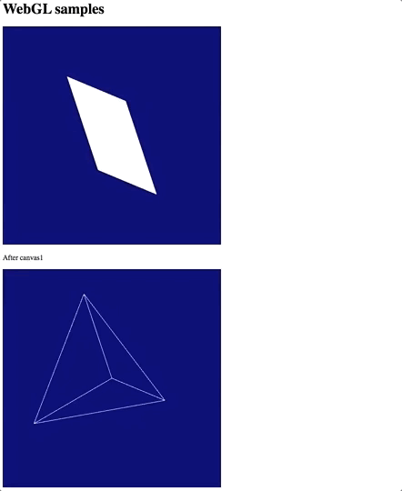

To do: more sophisticated examples following https://www.redwrasse.io/notes/webglandcomputergraphics
### Screenshot

### References
* https://blogoben.wordpress.com/2011/03/20/webgl-basics-2-white-2d-triangle/

